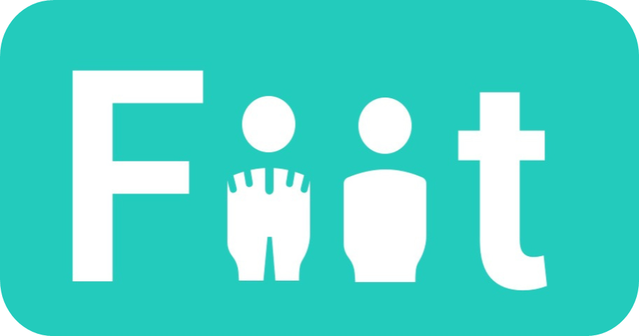
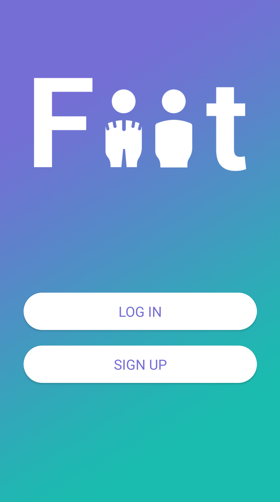
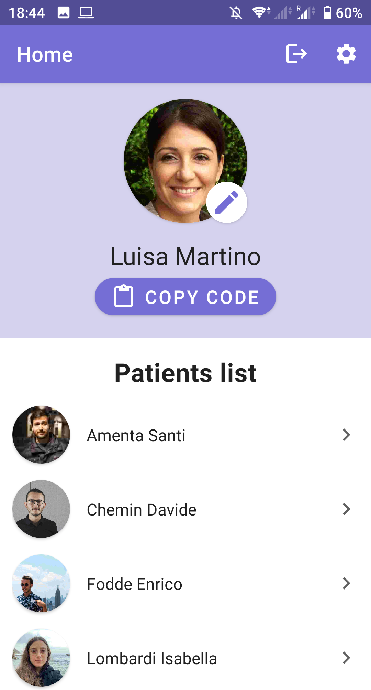
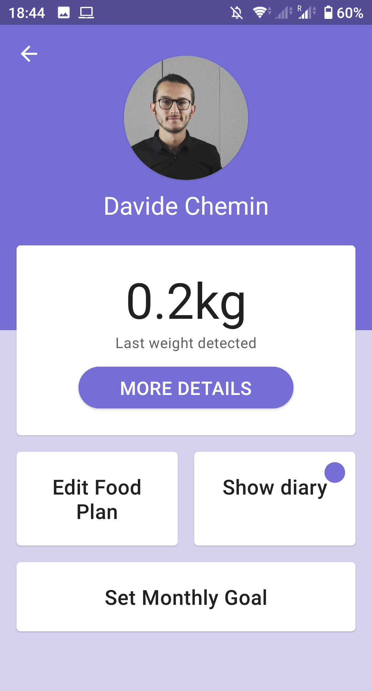

# FiitApp
 An Android App for the Digital Interaction Design course at Politecnico di Torino 
 Fall semester 2020/2021

<!-- ABOUT THE PROJECT -->
## About The Project

FiitApp is an Android app that connects to a physical scale, through an <b>Arduino Board</b> and a <b>Wireless Module</b>, and stores the weights on a <b>Firebase Database.</b>
The app retrives data from the DB and displays them. 
We developed a front-end architecture for the nutritionist and one for the patients. In this way they can share information and see their progresses.

### Built With
* [Android studio](https://developer.android.com/studio)
* [Arduino IDE](https://www.arduino.cc/en/software)

### Coding languages
* [Kotlin](https://kotlinlang.org/)
* [C++](https://isocpp.org/)

## Made by
* Amenta Santi - Back-end developer
* Chemin Davide - Designer and Front-end developer
* Fodde Enrico - Back-end developer